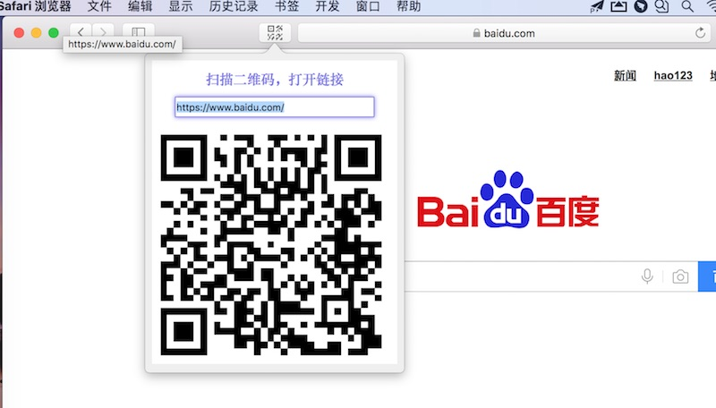

# QRCode.SafariExtension

**1.这是一个safari插件！**

* 可以将当前打开的页面生成二维码
* 新打开页面输入文字，可生成二维码
* 修改输入框，回车，可更新二维码

**2.直接双击`QRCode.safariextz`安装**

效果图：

**3.`QRCode.safariextension`是源代码**

* 可以用safari的显示扩展构建器调试编辑